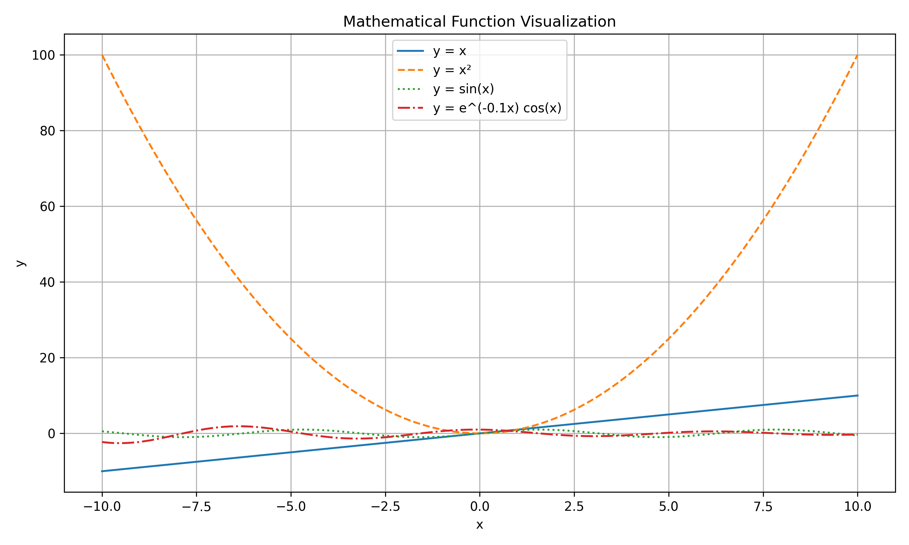
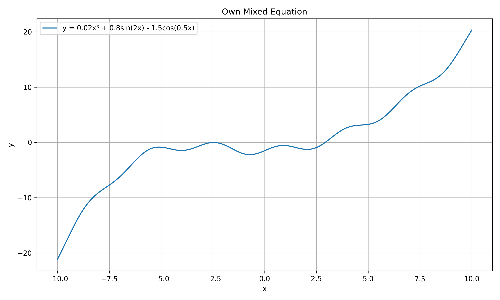
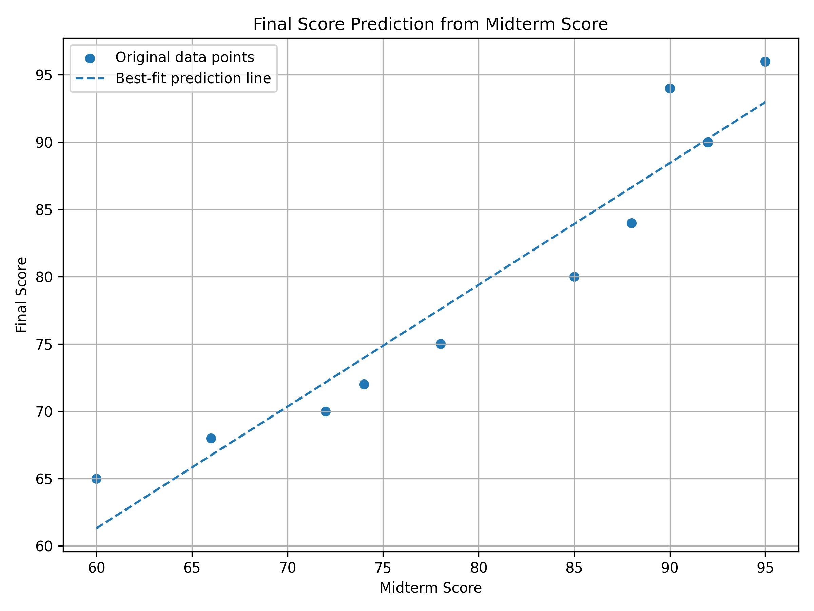

# Math Visualization Assignment

## Project Description
This project visualizes mathematical functions and student score data with Python. It creates line graphs, a scatter plot, a histogram, a bar chart and a simple best-fit prediction line. This project is OSS course project at Assignment Task 8 of Week 11. Student: Azizbek

## Libraries Used
- NumPy
- Matplotlib

## How to Run the Code
1. Install the required libraries (if they are not already installed):

```bash
pip install numpy matplotlib
```

2. Run the program:

```bash
python math_visualization.py
```

3. The program generates these image files using my functions which i defined after compiling:
- `function_plot.png`
- `own_equation.png`
- `score_scatter.png`
- `score_histogram.png`
- `score_bar_chart.png`
- `score_prediction.png`

After generating the visualization images, program finally prints predicted final scores for midterm scores 50, 75, and 100.

## Screenshots

### Mathematical Function Visualization


### Own Mixed Equation


### Score Prediction


## Short Explanation

### How does visualization help us understand mathematical functions and data?
Visualization changes the formulas and raw numbers to graphs to make it easier to see shapes, patterns, trends and differences that are clearer, unlike numbers alone.

### Which plot was most useful in this assignment and why?
The best-fit prediction plot was the most useful because it shows the relationship between midterm scores and final scores. It also gives a simple way to estimate a final score from a midterm score.

### What is the role of NumPy and Matplotlib in this project?
NumPy is used to create number ranges, calculate equations, store score data and find the best-fit line with its defined method `np.polyfit()`. Matplotlib is used to draw the graphs, add titles, labels, legends and grids then save the final images.